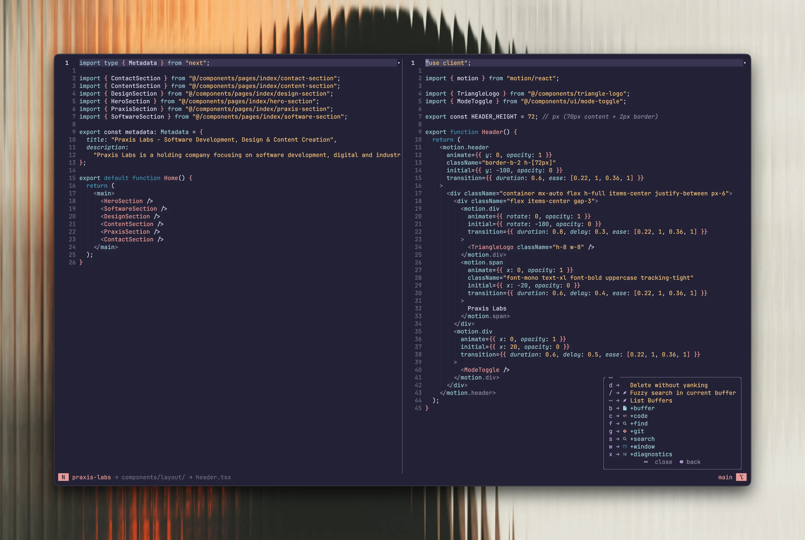

# ZenVim

> A modern, performant Neovim configuration focused on simplicity, speed, and an exceptional developer experience.




## Philosophy

ZenVim is built on three core principles:

### 1. **Performance First**

- Lazy loading for optimal startup times
- Modern, Rust-based plugins (blink.cmp, flash.nvim)
- Minimal overhead with carefully selected, non-overlapping tools
- Fast fuzzy finding and completion (sub-4ms updates)

### 2. **Simplicity & Clarity**

- Clean, modular architecture
- One tool per job - no redundant plugins
- Intuitive keybindings with which-key discovery
- Sensible defaults that "just work"

### 3. **Developer Experience**

- VSCode/Cursor-like completion workflow
- AI-powered suggestions via GitHub Copilot
- Comprehensive LSP support for 12+ languages
- Beautiful UI with Rose Pine theme and modern components

## Features

- 🚀 **Blazing Fast** - Optimized lazy loading, <50ms startup
- 🎨 **Beautiful UI** - Rose Pine theme, lualine, scrollbar, noice.nvim
- 🧘 **Zen Mode** - Distraction-free coding with centered window and hidden UI
- 🤖 **AI-Powered** - Supermaven for fast inline AI completions
- 📝 **Smart Completion** - blink.cmp with LSP, snippets, path, and buffer sources
- 🔍 **Fuzzy Everything** - Snacks picker for files, grep, LSP symbols
- 🌳 **Treesitter** - Advanced syntax highlighting and text objects
- 🔧 **Auto-formatting** - Format on save with conform.nvim
- 🎯 **LSP Ready** - 12 pre-configured language servers
- 🔀 **Git Integration** - GitSigns + LazyGit
- 📦 **Auto-install** - Mason handles all LSP servers, formatters, linters

## Documentation

- ⌨️ **[Keybindings Reference](docs/keybinds.md)** - Complete keybinding guide organized by functionality
- 📖 **[Development Roadmap](docs/roadmap.md)** - Feature tracking, completed work, and future plans
- 🤖 **[CLAUDE.md](CLAUDE.md)** - Detailed documentation for AI assistance and architecture

## Installation

### Prerequisites

- Neovim >= 0.11.0
- Node.js >= 18.x (for Copilot)
- Git
- A [Nerd Font](https://www.nerdfonts.com/) (recommended: JetBrainsMono Nerd Font)
- ripgrep (for grep functionality)
- fd (optional, for faster file finding)

### Quick Start

```bash
# Backup your existing config
mv ~/.config/nvim ~/.config/nvim.backup

# Clone ZenVim
git clone https://github.com/drucial/zen-vim.git ~/.config/nvim

# Launch Neovim (plugins will auto-install)
nvim
```

### First Launch

On first launch, lazy.nvim will automatically:

1. Install all plugins
2. Compile blink.cmp (Rust components)
3. Install Treesitter parsers
4. Set up Mason LSP servers

This may take 2-3 minutes. Once complete, restart Neovim.

### Post-Installation

**Verify health:**

```vim
:checkhealth
```

**Update plugins:**

```vim
:Lazy update
```

## Plugin List

### Core & UI

| Plugin                                                               | Purpose              | Why?                                                             |
| -------------------------------------------------------------------- | -------------------- | ---------------------------------------------------------------- |
| [rose-pine](https://github.com/rose-pine/neovim)                     | Color scheme         | Beautiful, low-contrast theme with excellent syntax highlighting |
| [mini.icons](https://github.com/echasnovski/mini.nvim)               | Icons                | Fast, minimal icon provider                                       |
| [dressing.nvim](https://github.com/stevearc/dressing.nvim)           | UI improvements      | Better vim.ui.select and vim.ui.input interfaces                 |
| [vim-kitty-navigator](https://github.com/knubie/vim-kitty-navigator) | Terminal integration | Seamless navigation between Neovim and Kitty terminal            |
| [oil.nvim](https://github.com/stevearc/oil.nvim)                     | File explorer        | Edit your filesystem like a buffer                               |
| [nvim-notify](https://github.com/rcarriga/nvim-notify)               | Notifications        | Beautiful notification manager                                   |
| [noice.nvim](https://github.com/folke/noice.nvim)                    | UI overhaul          | Enhanced cmdline, messages, and popupmenu                        |
| [snacks.nvim](https://github.com/folke/snacks.nvim)                  | Utilities            | Dashboard, picker (fuzzy finder), zen mode, bigfile handling     |
| [nvim-scrollbar](https://github.com/petertriho/nvim-scrollbar)       | Scrollbar            | Visual scrollbar with diagnostic/search indicators               |
| [lualine.nvim](https://github.com/nvim-lualine/lualine.nvim)         | Statusline           | Beautiful statusline with breadcrumbs and git info               |

### Completion & AI

| Plugin                                                               | Purpose            | Why?                                                     |
| -------------------------------------------------------------------- | ------------------ | -------------------------------------------------------- |
| [blink.cmp](https://github.com/Saghen/blink.cmp)                     | Completion engine  | Modern, Rust-based completion with <4ms updates          |
| [supermaven-nvim](https://github.com/supermaven-inc/supermaven-nvim) | AI completions     | Fast inline AI suggestions (faster than Copilot/Tabnine) |
| [friendly-snippets](https://github.com/rafamadriz/friendly-snippets) | Snippet collection | Pre-configured snippets for dozens of languages          |

### LSP & Language Support

| Plugin                                                                                    | Purpose         | Why?                                                |
| ----------------------------------------------------------------------------------------- | --------------- | --------------------------------------------------- |
| [mason.nvim](https://github.com/williamboman/mason.nvim)                                  | Package manager | Install and manage LSP servers, formatters, linters |
| [mason-lspconfig.nvim](https://github.com/williamboman/mason-lspconfig.nvim)              | LSP bridge      | Automatically configure installed LSP servers       |
| [mason-tool-installer.nvim](https://github.com/WhoIsSethDaniel/mason-tool-installer.nvim) | Tool installer  | Auto-install formatters and linters                 |
| [nvim-lspconfig](https://github.com/neovim/nvim-lspconfig)                                | LSP configs     | Pre-configured LSP setups for all languages         |
| [schemastore.nvim](https://github.com/b0o/schemastore.nvim)                               | JSON schemas    | JSON schema validation for config files             |

**Pre-configured Language Servers:**

- TypeScript/JavaScript (ts_ls)
- ESLint (eslint)
- Ruby/Rails (ruby_lsp)
- Python (pyright)
- Bash (bashls)
- Tailwind CSS (tailwindcss)
- Prisma (prismals)
- Markdown (marksman)
- JSON (jsonls with schemastore for intelligent completion)
- HTML (html)
- CSS (cssls)
- Lua (lua_ls)

### Code Quality & Formatting

| Plugin                                                  | Purpose   | Why?                                       |
| ------------------------------------------------------- | --------- | ------------------------------------------ |
| [conform.nvim](https://github.com/stevearc/conform.nvim) | Formatter | Fast, async formatting with format-on-save |

**Pre-configured Formatters:**

- Prettier (TS/JS/CSS/HTML/JSON/YAML/MD)
- eslint_d (TS/JS auto-fix with support for flat config format)
- stylua (Lua)
- black + isort (Python)
- rubocop (Ruby)
- shfmt (Shell)

### Editor Enhancements

| Plugin                                                                                        | Purpose           | Why?                                                |
| --------------------------------------------------------------------------------------------- | ----------------- | --------------------------------------------------- |
| [nvim-treesitter](https://github.com/nvim-treesitter/nvim-treesitter)                         | Syntax parsing    | Advanced syntax highlighting and code understanding |
| [nvim-treesitter-textobjects](https://github.com/nvim-treesitter/nvim-treesitter-textobjects) | Text objects      | Select/navigate functions, classes, parameters      |
| [nvim-ts-autotag](https://github.com/windwp/nvim-ts-autotag)                                  | Auto-close tags   | Auto-close/rename HTML/JSX/XML tags                 |
| [mini.nvim](https://github.com/echasnovski/mini.nvim)                                         | Micro-plugins     | Pairs, comment, bufremove, icons                    |
| [nvim-surround](https://github.com/kylechui/nvim-surround)                                    | Surround text     | Add/delete/change surrounding chars and HTML tags   |
| [flash.nvim](https://github.com/folke/flash.nvim)                                             | Navigation        | Quick jump navigation with search labels            |
| [grug-far.nvim](https://github.com/MagicDuck/grug-far.nvim)                                   | Search/Replace    | Visual search and replace across files              |
| [todo-comments.nvim](https://github.com/folke/todo-comments.nvim)                             | Todo highlighting | Highlight and search TODO/FIXME/NOTE comments       |

### Git Integration

| Plugin                                                      | Purpose         | Why?                                          |
| ----------------------------------------------------------- | --------------- | --------------------------------------------- |
| [gitsigns.nvim](https://github.com/lewis6991/gitsigns.nvim) | Git decorations | Show git changes in sign column, inline blame |
| [lazygit.nvim](https://github.com/kdheepak/lazygit.nvim)    | Git UI          | Full-featured Git interface                   |

### Utilities

| Plugin                                                    | Purpose         | Why?                                               |
| --------------------------------------------------------- | --------------- | -------------------------------------------------- |
| [which-key.nvim](https://github.com/folke/which-key.nvim) | Keybinding help | Interactive keybinding discovery                   |
| [trouble.nvim](https://github.com/folke/trouble.nvim)     | Diagnostics UI  | Beautiful diagnostics, quickfix, and location list |
| [plenary.nvim](https://github.com/nvim-lua/plenary.nvim)  | Lua utilities   | Required by many plugins                           |

## Key Bindings

<details>
<summary><b>📋 Leader Key Commands (Space)</b></summary>

### File Operations (f)

- `<leader>ff` - Find Files
- `<leader>fs` - Find String (live grep)
- `<leader>fh` - Find Help tags
- `<leader>fr` - Find Recent Files
- `<leader>fw` - Find Word under cursor
- `<leader>fd` - Find Diagnostics
- `<leader>fc` - Find Config Files
- `<leader>fp` - Find Projects
- `<leader>fC` - Find Commands
- `<leader>fk` - Find Keymaps
- `<leader>/` - Fuzzy search in current buffer

### Buffer Management (b)

- `<leader><leader>` - List Buffers (quick access)
- `<leader>bb` - List Buffers
- `<leader>bd` - Delete Buffer
- `<leader>bn` - Next Buffer
- `<leader>bp` - Previous Buffer
- `<leader>bw` - Write/Save Buffer

### Quick Actions (Single-Letter)

- `<leader>W` - Write/Save Buffer
- `<leader>X` - Delete Buffer
- `<leader>l` - Lazy Plugin Manager
- `<leader>n` - Notification History
- `<leader>\\` - Toggle Terminal Panel

### Quit (q)

- `<leader>qq` - Quit Window
- `<leader>qa` - Quit All
- `<leader>qQ` - Quit Without Saving

### Code Actions (c)

- `<leader>cf` - Code Format
- `<leader>cl` - LSP Info
- `<leader>ca` - Code Action
- `<leader>cA` - Source Action
- `<leader>ci` - Code Info (hover)
- `<leader>cr` - Rename
- `<leader>cc` - Run Codelens
- `<leader>cC` - Refresh Codelens

### Search Operations (s)

- `<leader>sa` - Search Autocmds
- `<leader>sb` - Search Buffer Lines
- `<leader>sB` - Search Grep Buffers
- `<leader>sc` - Search Command History
- `<leader>sC` - Search Commands
- `<leader>sd` - Search Diagnostics (Current Buffer)
- `<leader>sD` - Search Diagnostics (Workspace)
- `<leader>sg` - Search Grep
- `<leader>sh` - Search Help
- `<leader>sH` - Search Highlights
- `<leader>si` - Search Icons
- `<leader>sj` - Search Jumps
- `<leader>sk` - Search Keymaps
- `<leader>sl` - Search Location List
- `<leader>sm` - Search Marks
- `<leader>sM` - Search Man Pages
- `<leader>sq` - Search Quickfix
- `<leader>sR` - Search Resume
- `<leader>s"` - Search Registers
- `<leader>s/` - Search History
- `<leader>sr` - Search and Replace (grug-far)
- `<leader>ss` - Search Buffer Symbols (LSP)
- `<leader>sS` - Search Workspace Symbols (LSP)
- `<leader>st` - Search Todo Comments
- `<leader>sT` - Search Todo/Fix/Fixme
- `<leader>sw` - Search Word

#### Noice (sn)

- `<leader>snl` - Show Last Message
- `<leader>snh` - Show Message History
- `<leader>sna` - Show All Messages
- `<leader>snd` - Dismiss All Notifications
- `<leader>snt` - Open Noice Picker

### Window Management (w)

#### Navigation
- `<leader>wh/j/k/l` - Go to Left/Lower/Upper/Right Window
- `<leader>ww` - Switch Windows
- `<leader>wH/J/K/L` - Move Window Far Left/Down/Up/Right

#### Splits
- `<leader>ws` / `<leader>w-` - Split Window Below
- `<leader>wv` / `<leader>w|` - Split Window Right

#### Close/Quit
- `<leader>wd` - Delete Window
- `<leader>wq` - Quit Window
- `<leader>wo` - Close All Other Windows

#### Resize
- `<leader>w+` / `<leader>w-` - Increase/Decrease Height
- `<leader>w>` / `<leader>w<` - Increase/Decrease Width
- `<leader>w=` - Equalize Windows

#### Maximize
- `<leader>w_` - Maximize Height
- `<leader>w|` - Maximize Width

#### Swap & Zoom
- `<leader>wx` - Swap with Next
- `<leader>wm` - Maximize Toggle (Zoom)

### Surround (e)

Enclose/surround text with quotes, brackets, tags, etc.

#### Normal Mode
- `<leader>ea{motion}{char}` - Surround motion (e.g., `<leader>eaw"` wraps word in quotes, `<leader>eaw<div>` wraps in div tag)
- `<leader>eA` - Surround current line
- `<leader>el{motion}{char}` - Surround motion on new lines
- `<leader>eL` - Surround current line on new lines
- `<leader>ed{char}` - Delete surround (e.g., `<leader>ed"` deletes quotes, `<leader>edt` deletes tag)
- `<leader>ec{old}{new}` - Change surround (e.g., `<leader>ec"'` changes quotes, `<leader>ect<span>` changes tag)
- `<leader>eC{old}{new}` - Change surround with new lines

#### Visual Mode
- `<leader>es{char}` - Surround selection (e.g., `<leader>es<div>` wraps in div tag)
- `<leader>eS{char}` - Surround selection with new lines

### UI Toggles

Quick access toggles using Alt key:

- `<A-\>` - Toggle Terminal Panel (VSCode-style stacking)
- `<A-t>` - New Terminal (create in stack)
- `<A-]>` / `<A-[>` - Next/Previous Terminal
- `<A-z>` - Toggle Zen Mode (distraction-free coding)
- `<A-g>` - Toggle LazyGit (floating window, works in all modes)
- `<A-f>` - Toggle Find and Replace (Grug-far)
- `<A-s>` - Write/Save current buffer (works in all modes)
- `<A-w>` - Close current buffer (works in all modes)

### Git Operations (g)

- `<leader>gg` - LazyGit (floating window)
- `<A-g>` - Toggle LazyGit (quick access, works in all modes)
- `<leader>gc` - LazyGit (cwd)
- `<leader>gl` - Git Log
- `<leader>gf` - Git File History
- `<leader>gb` - Git Browse (open in browser)
- `<leader>gB` - Git Browse (copy URL)

#### Git Hunks (gh)

- `<leader>ghs` - Stage Hunk
- `<leader>ghr` - Reset Hunk
- `<leader>ghS` - Stage Buffer
- `<leader>ghu` - Undo Stage Hunk
- `<leader>ghR` - Reset Buffer
- `<leader>ghp` - Preview Hunk Inline
- `<leader>ghb` - Blame Line
- `<leader>ghB` - Blame Buffer
- `<leader>ghd` - Diff This
- `<leader>ghD` - Diff This ~

### Diagnostics (x)

- `<leader>xx` - Diagnostics (Trouble)
- `<leader>xX` - Buffer Diagnostics (Trouble)
- `<leader>xs` - Symbols (Trouble)
- `<leader>xl` - LSP Definitions/References (Trouble)
- `<leader>xL` - Location List (Trouble)
- `<leader>xQ` - Quickfix List (Trouble)
- `<leader>xt` - Todo (Trouble)
- `<leader>xT` - Todo/Fix/Fixme (Trouble)

</details>

<details>
<summary><b>⌨️ General Keybindings</b></summary>

### Insert Mode

- `jk` - Exit to normal mode
- `<Tab>` - Accept AI suggestion (Supermaven)
- `<C-]>` - Dismiss AI suggestion
- `<C-j>` - Accept next word of AI suggestion
- `<C-space>` - Show/toggle completions (blink.cmp)
- `<CR>` - Accept selected completion (if explicitly selected)
- `<C-y>` - Force accept current item
- `<Up>` / `<Down>` - Navigate completions
- `<C-n>` / `<C-p>` - Alternative navigation
- `<C-e>` - Hide completion menu

### Normal Mode

- `<Esc>` - Clear search highlights
- `<C-space>` - Start Treesitter incremental selection
- `<C-d>` / `<C-u>` - Scroll down/up and center
- `n` / `N` - Next/previous search result (centered)
- `s` - Flash jump (quick navigation)
- `S` - Flash Treesitter
- `-` - Open parent directory (oil.nvim)

### Visual Mode

- `<C-space>` - Expand selection to next syntax node
- `<bs>` - Shrink selection to previous syntax node
- `<` / `>` - Indent left/right (maintains selection)
- `<A-S-Down>` / `<A-S-Up>` - Move lines up/down

### LSP (when attached)

- `gd` - Goto Definition
- `gD` - Goto Declaration
- `gr` - References
- `gI` - Goto Implementation
- `gy` - Goto Type Definition
- `K` - Hover
- `gK` - Signature Help
- `[d` / `]d` - Prev/Next Diagnostic

### Navigation

- `]h` / `[h` - Next/Previous git hunk
- `]t` / `[t` - Next/Previous todo comment
- `]f` / `[f` - Next/Previous function
- `]c` / `[c` - Next/Previous class
- `<C-h/j/k/l>` - Navigate splits/Kitty panes

### Treesitter Text Objects

- `af` / `if` - Around/Inside function
- `ac` / `ic` - Around/Inside class
- `aa` / `ia` - Around/Inside parameter

</details>

## Configuration Structure

```
~/.config/nvim/
├── init.lua                       # Entry point
├── lazy-lock.json                # Plugin version lock
├── CLAUDE.md                     # Detailed documentation
├── README.md                     # This file
├── docs/
│   ├── keybinds.md              # Complete keybinding guide
│   ├── roadmap.md               # Development roadmap
│   └── performance-optimization.md  # Performance improvements
├── lua/
│   ├── config/
│   │   ├── lazy.lua             # Lazy.nvim bootstrap
│   │   ├── opts.lua             # Neovim options
│   │   ├── autocmds.lua         # Autocommands
│   │   └── keybinds.lua         # Global keybindings
│   └── plugins/
│       ├── init.lua             # Core plugins (plenary, icons, etc.)
│       ├── rose-pine.lua        # Color scheme
│       ├── oil.lua              # File explorer
│       ├── nvim-notify.lua      # Notifications
│       ├── noice.lua            # UI overhaul
│       ├── snacks.lua           # Dashboard, picker, zen mode
│       ├── nvim-scrollbar.lua   # Scrollbar
│       ├── nvim-highlight-colors.lua  # Color highlighting
│       ├── lsp.lua              # LSP + Mason configuration
│       ├── blink-cmp.lua        # Completion engine
│       ├── supermaven.lua       # AI inline completions
│       ├── conform.lua          # Formatting
│       ├── flash.lua            # Quick navigation
│       ├── grug-far.lua         # Search and replace
│       ├── todo-comments.lua    # Todo highlighting
│       ├── edgy.lua             # Panel management
│       ├── gitsigns.lua         # Git decorations
│       ├── lazygit.lua          # Git UI
│       ├── treesitter.lua       # Syntax highlighting
│       ├── which-key.lua        # Keybinding discovery
│       ├── lualine.lua          # Statusline
│       ├── mini.lua             # Mini.nvim modules
│       └── trouble.lua          # Diagnostics UI
```

## Customization

### Adding a New Language Server

1. Add to mason-lspconfig in `lua/plugins/lsp.lua`:

```lua
ensure_installed = {
  "your_lsp_here",
  -- ... other servers
},
```

2. Configure the server:

```lua
vim.lsp.config("your_lsp_here", {
  settings = {
    -- Your settings
  },
})
```

3. Restart Neovim - Mason will auto-install

### Adding a Formatter

Edit `lua/plugins/conform.lua`:

```lua
formatters_by_ft = {
  your_filetype = { "your_formatter" },
}
```

Add to mason-tool-installer in `lua/plugins/lsp.lua`:

```lua
ensure_installed = {
  "your_formatter",
}
```

### Changing Theme

Edit `lua/plugins/rose-pine.lua`:

```lua
require("rose-pine").setup({
  variant = "moon",  -- Change to: moon, main, or dawn
})
```

### Disabling Format on Save

```vim
:FormatDisable        " Globally
:FormatDisable!       " Current buffer only
```

## Troubleshooting

### Plugins not installing

```vim
:Lazy sync
:Lazy clean
```

### LSP not working

```vim
:LspInfo              " Check LSP status
:Mason                " Check installed servers
:checkhealth          " Full health check
```

### Slow startup

```vim
:Lazy profile         " Check plugin load times
```

## Credits

ZenVim is built on the shoulders of giants:

- [LazyVim](https://github.com/LazyVim/LazyVim) - Configuration inspiration
- [kickstart.nvim](https://github.com/nvim-lua/kickstart.nvim) - Best practices
- [Neovim](https://neovim.io/) - The editor
- All plugin authors - Thank you! ❤️

## License

MIT License - See [LICENSE](LICENSE) for details

---

**Maintained by:** [drucial](https://github.com/drucial)

**Questions?** Open an issue on [GitHub](https://github.com/drucial/zen-vim/issues)
